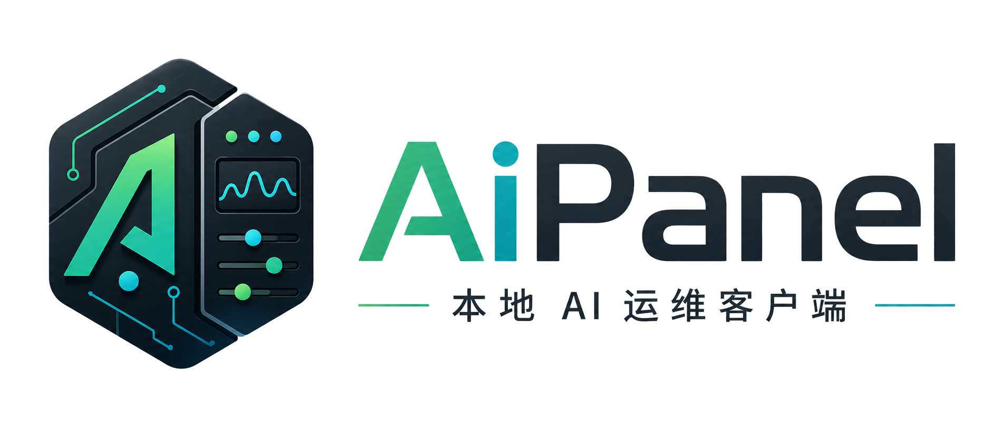
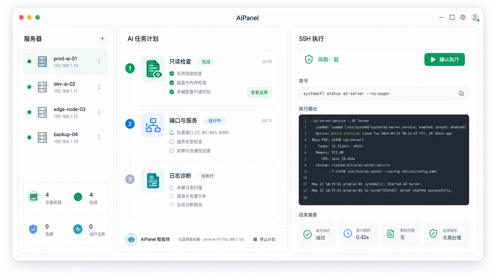

<p align="center"><a href="#"></a></p>
<p align="center"><b>Local AI Server Operations Client</b></p>
<p align="center"><b>本地运行、通过 SSH 管理服务器的 AI 运维客户端</b></p>

<p align="center">
  <a href="#"></a>
  <a href="#"></a>
  <a href="#"></a>
  <a href="./LICENSE"></a>
</p>

<p align="center">
  <a href="/README.md"></a>
  <a href="/docs/README.zh-Hans.md"></a>
</p>



------------------------------

## What is AiPanel?

AiPanel is a local AI operations client for Linux servers.

Unlike traditional server panels that must be installed and kept running on every VPS, AiPanel runs on your local machine and connects to servers through SSH. It turns natural language requests into reviewable plans, executes approved actions remotely, and summarizes the result.

- **Zero resident panel on servers**: no long-running panel process is required on the VPS;
- **SSH-first operations**: connect through standard SSH without opening a new public web admin entrance;
- **AI planning before execution**: generate clear plans, risk labels, and commands before running anything;
- **Read-only diagnosis mode**: inspect CPU, memory, disk, ports, services, Docker, Nginx, logs, and firewalls safely;
- **Deployment workflows**: install Docker, deploy Docker Compose apps, configure reverse proxy, HTTPS, and health checks;
- **Local audit trail**: keep task plans, command history, outputs, and summaries on the local client.

## Quick Start

AiPanel is at the **desktop MVP** stage — a Tauri v2 + React app you run locally.

```sh
pnpm install          # install workspace deps
pnpm build:ui         # build the @aipanel/ui design system
pnpm tauri:dev        # launch the desktop app (needs the Rust toolchain)
# or `pnpm dev` for the frontend only, in a browser (backend calls fall back to mocks)
```

Credentials use the system Keychain by default, including in `tauri:dev`.
For mock-only development, set `AIPANEL_CREDENTIAL_BACKEND=mock`.

In the app you can add a server, test SSH connectivity, run a read-only health
check, turn a request into a reviewable plan, approve and execute it, and review
the local audit trail.

## Quality Gates

For normal development and CI, run the non-secret gate:

```sh
pnpm ci:check
```

This typechecks the workspace, runs the Rust test suite, runs the bundled Codex
app-server integration check, runs Rust Clippy with warnings denied, and builds
the frontend packages. Run `scripts/fetch-codex.sh` first if the bundled sidecar
has not been fetched for your platform.

Before shipping a macOS build, run the full release gate:

```sh
pnpm release:check
```

This checks the bundled Codex app-server sidecar, starts it through the real
integration test, typechecks the workspace, runs the Rust test suite, runs Rust
Clippy with warnings denied, builds the frontend, builds the Tauri app, verifies
the app executable and sidecar match the target architecture, then verifies the
macOS app bundle and DMG are signed with a Developer ID Application identity and
have valid notarization tickets. Development-signed or unstapled builds fail
this gate.

## Roadmap

- [x] Project positioning
- [x] README structure
- [x] Initial logo and preview assets
- [x] Desktop client (Tauri v2 + React) with the AiPanel UI design system
- [x] SSH connection manager (add servers, connectivity test)
- [x] Read-only server doctor
- [x] AI task planning — real LLM via an OpenAI-compatible provider (structured
      output), with an offline mock fallback
- [x] Autonomous read-only diagnosis (the agent investigates via read-only tools)
- [x] Command risk review (Low / Medium / High / Blocked) with confirm / second
      confirm before write actions + local audit log
- [x] Live streaming command/doctor output
- [x] Model provider manager (configure just a base URL + API key; models are
      auto-discovered via `/v1/models` and picked from the home composer)
- [x] Interactive SSH terminal + file manager (SFTP), Codex-style 3-pane workspace
- [x] Multi-server dashboard with favorites and foreground health monitoring
- [x] Codex app-server tool-call loop (turns) — `thread/start` → `turn/start` →
      event stream → tool dispatch/relay; preferred runtime with OpenAI fallback;
      covered by simulated event-stream tests and real bundled sidecar initialize /
      thread-start / turn-start protocol validation
- [x] Docker app deployment workflows — detect/install, Compose deploy, Caddy/Nginx
      reverse proxy + HTTPS, post-deploy health checks; Uptime Kuma / n8n / WordPress /
      PostgreSQL / Redis templates, each a risk-reviewed Plan
- [x] Real-time server monitoring — a Codex-style dropdown layer with system facts,
      CPU/memory/disk/load ring gauges, container/service/port/process counts, and a
      traffic chart; sampled every 3s over read-only SSH with no resident agent
- [x] In-app online updates — signed releases via GitHub Releases (Tauri updater +
      minisign); version managed by `vX.Y.Z` tags; check/download/install + relaunch
      from Settings, with an optional silent check on startup
- [x] Test & CI baseline — Rust unit/integration tests + frontend vitest, Clippy
      (`-D warnings`), and a one-shot `pnpm ci:check` gate

## Documentation

- [中文文档](./docs/README.zh-Hans.md)
- [Roadmap](./docs/ROADMAP.zh-Hans.md)
- [Release & online updates](./docs/RELEASE.zh-Hans.md)
- [Architecture](./docs/ARCHITECTURE.zh-Hans.md)
- [Tech Stack](./docs/TECH_STACK.zh-Hans.md)
- [Security Model](./docs/SECURITY_MODEL.zh-Hans.md)
- [Security Policy](./SECURITY.md)
- [Contributing](./CONTRIBUTING.md)
- [Image generation prompts](./assets/prompts/gpt-image-2.md)

## License

Copyright (c) 2026 AiPanel.

Licensed under the [GNU Affero General Public License v3.0](./LICENSE).
